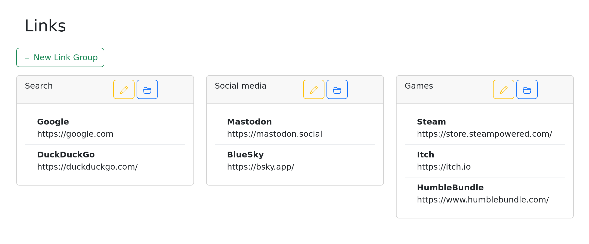

# Links

Links is a free, open-source, self-hosted website which stores and syncs your bookmarks.

It aims to provide a replacement for your browser's new tab page, and to provide an alternative to your browser's built-in bookmarks.

Its primary focus is on providing syncable tab groups, which allow you to open several websites at once.

* Note: this software is a work in progress and is not fully functional.

